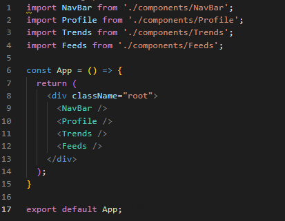
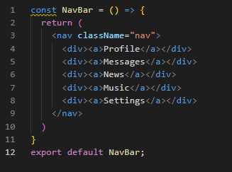

Link to video: https://www.youtube.com/watch?v=kl5m7eDupUc&feature=youtu.be

Link to slides: https://elizavetapanasiuk.github.io/reveal.js/#/slide1
# React
React is a declarative, efficient, and flexible JavaScript library for building user interfaces. 

It is currently one of the most popular JavaScript front-end libraries which has a strong foundation and a large community supporting it.

The goal of react is to provide high speed, simplicity and scalability.

React was created by Jordan Walke and Facebook company.

## Why did they create react?

When programmers were developing facebook, they had a lot of problems. One of them was synchronization between different parts of the site (it could be messages or alerts). Developers decided to split app into small logical components. Every component had its logic and was written on Javascript. But we know that Javascript has a little problem. Any work with the DOM tree is very expensive. Frequent updates of the DOM tree cause the application to slow down. It was a serious problem for the big site. So the conception of virtual Dom helped to decide the problem.
React can be used as a base in the development of single-page applications or mobile applications. Complex React applications usually require the use of additional libraries such as Redux, GraphQL or MobX.

## Why use ReactJs?

*	**Simplicity**: Beauty of ReactJS is its simplicity. It is a component-based language with a well-defined lifecycle. In React development developers use JSX which allows you to mix HTML with JavaScript. This is not a requirement and developer can write in clear JavaScript but JSX is much easier to use.
*	**Faster Go-To-Market Time**: organizations are keen to adapt to technologies that help them to go to market faster, complete their software solutions on time and implement them without any problems. ReactJS is  perfect for this since it has a high development speed because of its multiple reusable components. Developers find it easy to build applications at a great speed. It ensures high productivity. React also has React Native, a cross-platform mobile app development tool that works wonders.
*	**A Secure Future**: with technologies coming and going so fast, the need for a stable technology is what organizations are looking for. And, ReactJS is just that, since it is backed by big names like Facebook, Instagram and millions of developers globally.
*	**Ease Of Use**: with so many tools and frameworks, what developers get attracted to is the simplicity with which the tool operates. ReactJS is an easy option for novices and experts. It has not only streamlined the job of programming but has also simplified resource administration to a great level.
*	**Quick Rendering With V-DOM**: React uses a  virtual DOM. React creates a hash structure in memory that allows to calculate the difference between the previous and current states of the interface for optimal updating of the browser's DOM. In this way, the library independently decides which components of the page need to be updated.
*	**Efficient Design And Developer Tools**: react comes loaded with a great set of effective design, developer and debugging toolset. There are react developer tools for certain browsers like Chrome and Firefox. This makes it possible to track the virtual Dom and even the hierarchy of components.

## What organizations/brands use React?

*	Facebook
*	Instagram
*	Twitter
*	Netflix
*	Khan Academy
*	WhatsApp
*	Dropbox
*	Salesforce
*	Tesla
*	BBC
*	Github
*	Uber

## Architecture

At the heart of all React applications are components.

A component is a piece of the user interface. So, when building applications with React, we build a lot of independent, isolated and reusable components and then compose them to build complex user interfaces.

Every React app has at least one component, which we call the root component. This component represents the entire application and contains other child components. So, every React application is a tree of components. 

 

Here’s an example, if we want to build application like twitter, we can split this pages into components like NavBar, Profile, Trends, Feeds (which includes several components).

So as you see each component is a piece of UI. We can build these components in isolation and then put them together to build complex user interfaces.
Let’s consider an example of code written using reactJs. On the first piece of code we can see main component called App, which includes other components. Each component is represented by special tag. On the second piece of code we see a component NavBar. So the application consists of such little simple components represented by function that can be used as a tag with function name. 

We see that React is really powerful tool for creating web-applications.

## What are the benefits of react over other libraries and frameworks, such as Angular or Vue?

1. React has a lower level of abstraction. It means that you can use its power more efficient and create more efficient applications.
2. React is not a framework. It’s library that helps to sketch elements. It means that we can use any set of tools we want and create flexible solutions. 
3. React is the most popular tool for creating web-applications today. It has the greatest number of users and it means that there are a lot of ready solutions you can use for you project.

So I can say that react is one of the most perspective technologies for creating front-end part of web-applications and it’s a good idea to learn and use it right now.
